# Employee CSV Data Migration Project

Scrum Lord: Abdur-Rahmaan Azam

Github Control: Dhrushil

Documentation: David Carew

Lead Programmers/Tester: DK/Jamie

# Contents

[Task:](#_Toc108786338)

[Assignment:](#_Toc108786339)

[Phase 1:](#_Toc108786340)

[Phase 2:](#_Toc108786341)

# Task:

• To read data from a ```.csv``` file (provided), parse it, populate objects and add to a collection.

• To efficiently write the data from the objects to a relational database using ```JDBC```.

• To demonstrate good programming practices in OOP, SOLID, design patterns, testing, logging, etc.

## Assignment:

To complete this task, the team was first divided into separate tasks to maximise efficiency within the task. The Scrum master position was to Abdur in order to give us direction and keep us on task, Dhrushil was assigned to the job of overseeing all Git-related activities as well as slight programming in between, while Dogukhan and Jamie worked on the bulk of the assignment and David documented all achievements.

# Phase 1:

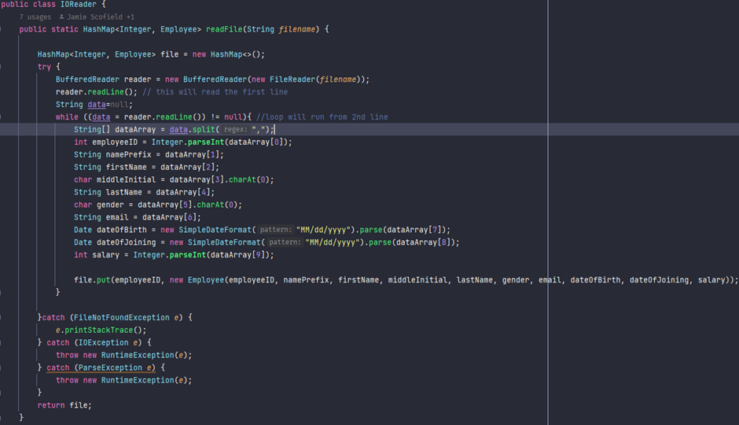

In order to begin phase 1, the team created a class that would enable data to be written and read from a CSV file. Using a Hashmap class, every Employee detail is stored as an integer, under the name file. The Buffered Reader Is used to read the file&#39;s first line and a while loop continues from the second line until reaching the end of the file. As the file is read, parts of the employee&#39;s details are kept within various data types, such as String Arrays, ints, Date and char. Finally, file.put maps the employee id to the rest of the employee data.

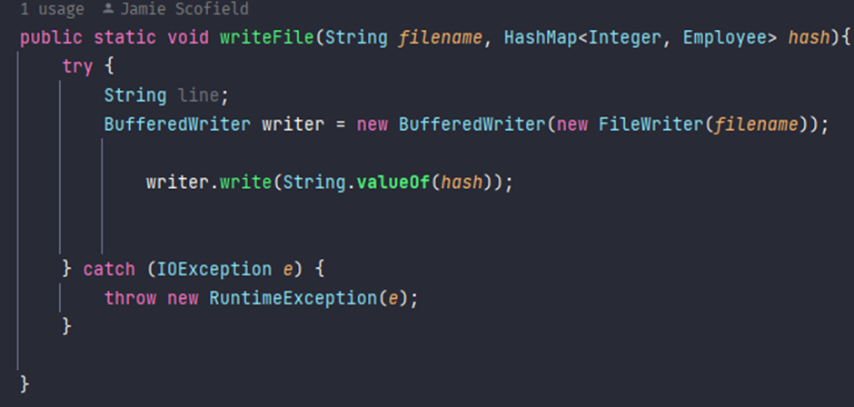

This class was built in order to write the values of the Employees into the CSV file, using BufferedWriter and a String. To ensure that any events that might occur during the execution of the program that disrupts the normal flow of instructions were caught, exceptions were thrown.

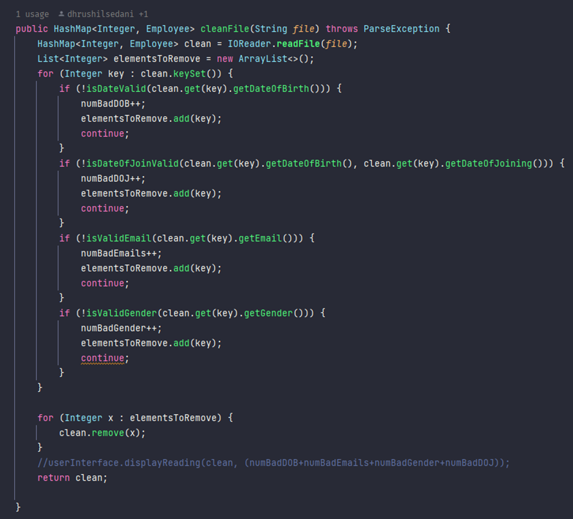

This class has 4 integers numBadDOB, numBadDOJ, numBadEmails and numBadGender. The function itself recieves a filepath string as a parameter, then the IOReader class reads this file and adds the data to a hashmap. The IOReader Class is there to open a file stream, read the data and create objects from the read data, after that they loop through the hashmap and just do simple datavalidations.

The datavalidations are functions of the Employee object, depending on which data of the employee is invalid the responding integer numeral will be increased. They also save all the keys of invalid hashmap entries in a separate list, then they simply loop though the list of invalid keys and remove the corresponding entries from the hashmap and finally the function returns a hashmap of validated employees.

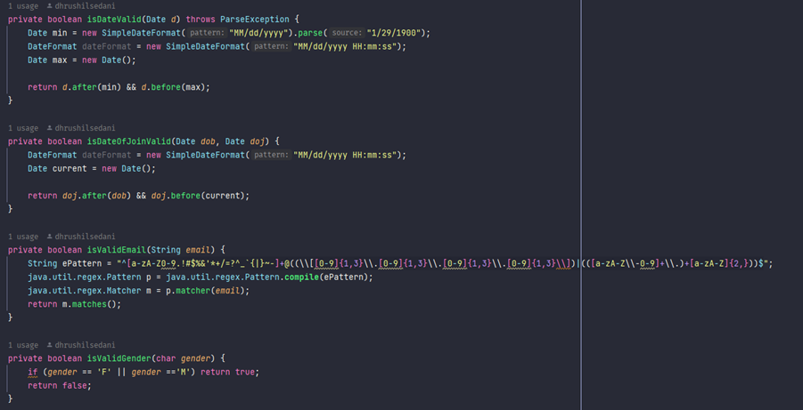

Each of these booleans return true or false depending on whether the data matches the format set. These are then used to clean out the data entires here: 

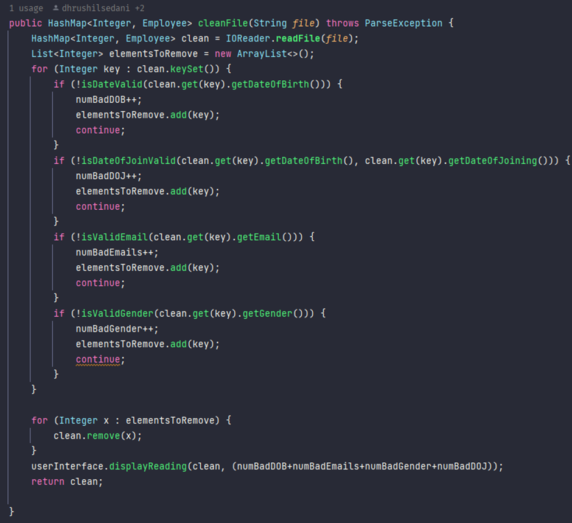
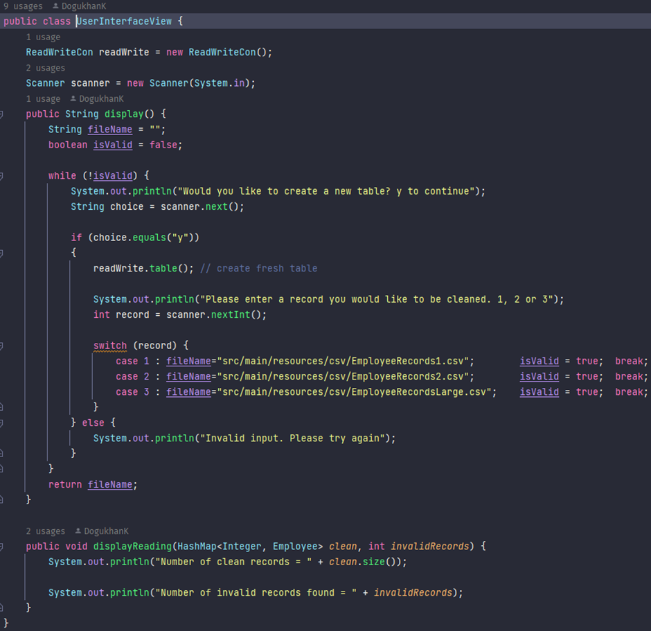

This class is the User Interface that is seen by the user and through thisfirst function gets a file from the user, stores it in a string then returns it to main. Then that string is passed into cleaning where the 2nd function is called to display the file&#39;s stats after cleaning.

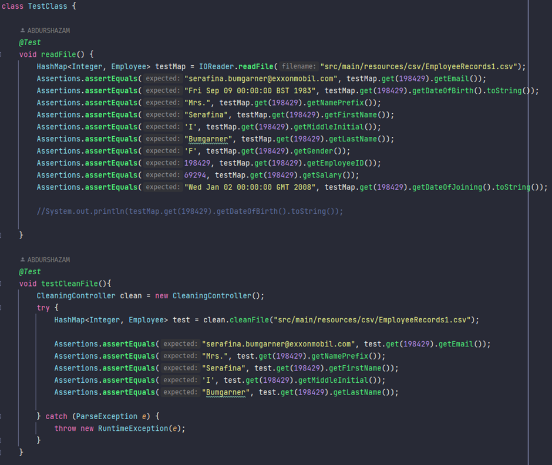

Here are the tests are done in order to ensure that the cleaning anf reading of files work efficiently in all areas as well as testing multiple tests for different subfunctions.

# Phase 2:

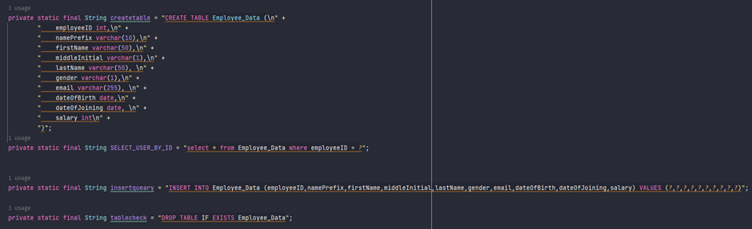

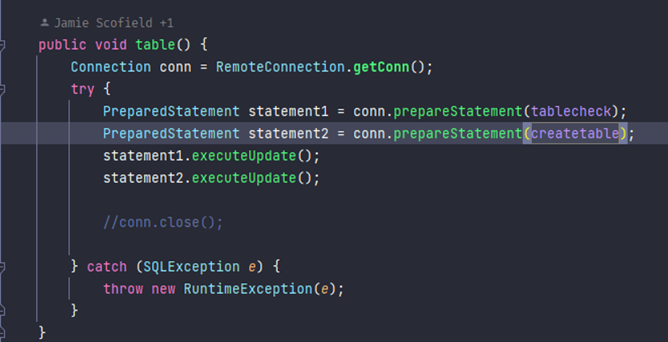

This method handles the table created and checks if it already exists. If the table is found to already exist it will be dropped.

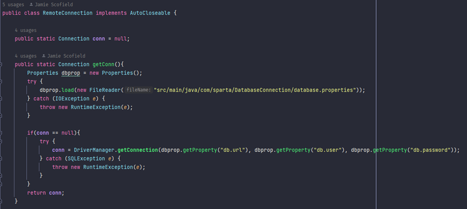

This class controls the connection to the database (MySQL) and creates a connection based on the account details written in the database properties file.

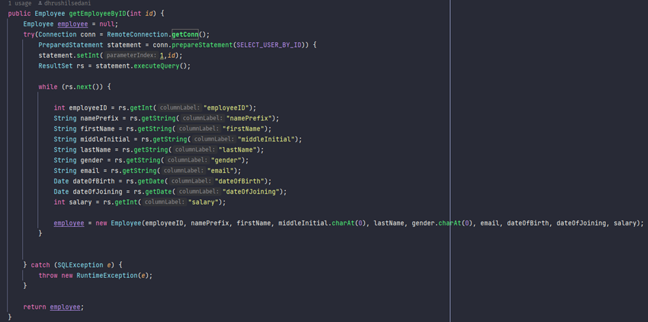

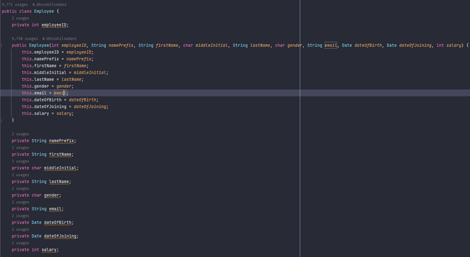

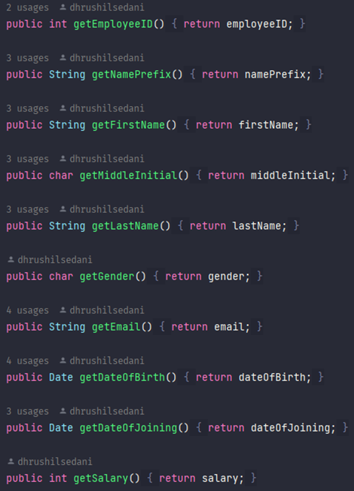

This code persists employee records and write code to retrieve individual records from the database. By selecting every part of the employees details (such as ID, names, email addresses, gender, etc) ad then writing them to a file.
